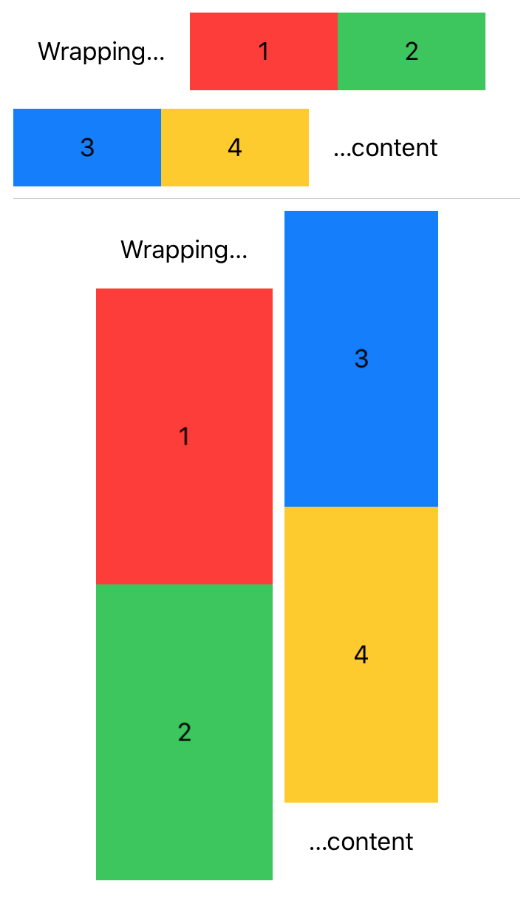

**WrapStack** is a set _SwiftUI_ views, `WHStack` and `WVStack` designed to add wrapping behavior to regular horizontal and vertical stacks.



# Example

Use similarly to `HStack` and `VStack`.

## Wrapping horizontal stack (WHStack)

Distribute horizontal content across multiple lines.

```swift
WVStack {
  Text("Wrapping…").fixedSize().padding()
  Color.red.frame(height: 200).overlay(Text("1"))
  Color.green.frame(height: 200).overlay(Text("2"))
  Color.blue.frame(height: 200).overlay(Text("3"))
  Color.yellow.frame(height: 200).overlay(Text("4"))
  Text("…content").fixedSize().padding()
}
```

## Wrapping vertical stack (WVStack)

Automatically expand vertical content into multiple columns.

```swift
WHStack {
  Text("Wrapping…").fixedSize().padding()
  Color.red.frame(height: 200).overlay(Text("1"))
  Color.green.frame(height: 200).overlay(Text("2"))
  Color.blue.frame(height: 200).overlay(Text("3"))
  Color.yellow.frame(height: 200).overlay(Text("4"))
  Text("…content").fixedSize().padding()
}
```

More info [in the docs](doc).

# Installation via SPM

In _XCode_ add the following URL to your project's _Swift Package_ dependencies:

 `https://github.com/swiftuilib/wrap-stack`

# Development

To modify the package contents while still being able to see SwiftUI _Previews_ use the provided `WrapStackPreview.xcodeproj`.
